## `std::jthread` — C++20's smarter thread

`std::jthread` (joinable thread) is a C++20 addition to `<thread>` that addresses two long-standing pain points of `std::thread`: forgetting to `join()` or `detach()` before destruction causes `std::terminate()`, and there was no standard way to ask a thread to stop cooperatively. `std::jthread` fixes both.

---

### Core differences vs `std::thread`

| Feature | `std::thread` | `std::jthread` |
|---|---|---|
| Destructor | Calls `std::terminate()` if joinable | Auto-joins (RAII) |
| Stop token | None | Built-in `std::stop_source` |
| Cooperative cancellation | Manual | `request_stop()` + `std::stop_token` |
| Move semantics | Yes | Yes |

---

### Key interfaces

**Construction** — same as `std::thread`, but the callable can optionally accept a `std::stop_token` as its first argument; if it does, `jthread` passes it automatically.

```cpp
std::jthread t1([] { /* no stop token needed */ });
std::jthread t2([](std::stop_token st) { /* cooperative stop */ });
```

**RAII destructor** — when `t` goes out of scope, its destructor calls `request_stop()` followed by `join()`. No more `std::terminate()` on a joinable thread that wasn't explicitly joined.

**`request_stop()`** — signals the thread to stop *cooperatively*. The thread must check `stop_token::stop_requested()` itself; it is never forcibly terminated.

**`get_stop_token()` / `get_stop_source()`** — let external code observe or signal the stop condition.

**`std::stop_callback`** — registers a callback that fires immediately when stop is requested, useful for waking blocked threads without polling.

---



---

### Example 1 — RAII auto-join

Without `jthread`, forgetting `join()` on a still-running thread crashes the program. With `jthread`, the destructor handles it:

```cpp
#include <thread>
#include <chrono>
#include <print>

void work() {
    using namespace std::chrono_literals;
    std::this_thread::sleep_for(200ms);
    std::println("Work done");
}

int main() {
    std::jthread t(work);
    // No join() needed — destructor joins automatically
}   // <-- t.~jthread() calls join() here
```

---

### Example 2 — Cooperative stop via `stop_token`

The thread's callable declares `std::stop_token` as its first parameter. `jthread` detects this signature and passes its internal token automatically:

```cpp
#include <thread>
#include <chrono>
#include <iostream>

// The producer thread function.
// std::stop_token must be the first parameter for jthread's automatic injection
// to work. Any additional parameters (here: 'id') are forwarded from the
// jthread constructor call in main — the same way std::thread forwards them.
void producer(std::stop_token st, int id)
{
    using namespace std::chrono_literals;   // enables the 100ms literal

    int n = 0;  // local item counter, private to this thread — no mutex needed

    // Cooperative cancellation loop.
    // stop_requested() is a cheap atomic flag read — safe to call on every
    // iteration without measurable overhead.
    // The loop does NOT terminate on its own; it only exits when an external
    // caller invokes request_stop() on the associated jthread (or stop_source).
    while (!st.stop_requested())
    {
        // Pre-increment so the first item logged is 1, not 0.
        std::cout << "producer " << id << ": item " << ++n << '\n';

        // Yield the CPU for 100 ms. During this sleep the stop flag may be
        // set by another thread, but stop_requested() is only checked at the
        // top of the next iteration — the thread will sleep the full 100 ms
        // before noticing. If sub-millisecond cancellation latency matters,
        // replace the sleep with a std::condition_variable_any::wait_for()
        // that also accepts a stop_token, so it can be woken immediately.
        std::this_thread::sleep_for(100ms);
    }

    // Reached only after stop_requested() returns true.
    // This is the graceful shutdown point: flush buffers, release resources,
    // log final state, etc. The thread function returns normally — no
    // exception, no forced kill.
    std::cout << "producer " << id << ": stopping gracefully\n";
}
// Stack frame destroyed here; 'n' goes out of scope.

int main()
{
    using namespace std::chrono_literals;

    // Construct the jthread, forwarding 42 as the 'id' argument.
    // jthread inspects the callable's first parameter type at compile time
    // (via if constexpr / SFINAE inside its constructor). Because it is
    // std::stop_token, jthread silently prepends its internal token to the
    // argument list before calling producer — no manual token passing needed.
    // The thread starts running immediately after this line.
    std::jthread t(producer, 42);

    // Main sleeps for ~350 ms while the producer runs.
    // With a 100 ms sleep per iteration the producer will complete roughly
    // 3 full iterations (items 1, 2, 3) before we reach the next line.
    std::this_thread::sleep_for(350ms);

    // Signal the producer to exit its loop.
    // This sets the stop_requested() flag atomically and returns immediately —
    // it does NOT wait for the thread to finish. The producer may still be
    // mid-sleep when this returns; it will notice the flag on its next
    // loop-condition check (up to 100 ms later in the worst case).
    t.request_stop();

    // jthread destructor fires here and calls join(), blocking main until
    // producer() returns. This guarantees the thread has fully completed its
    // graceful-shutdown code path before the program exits.
    // With std::thread you would need an explicit t.join() here; omitting it
    // would call std::terminate(). jthread makes the join automatic (RAII),
    // even if an exception unwinds the stack before this point.
}
```

Output (approximate):
```
producer 42: item 1
producer 42: item 2
producer 42: item 3
producer 42: stopping gracefully
```

One design note the comments point at: the `sleep_for(100ms)` inside the loop is the weak spot of this pattern. `stop_requested()` is only polled at the top of each iteration, so **cancellation latency is bounded by the sleep duration** — up to 100 ms after `request_stop()` the thread is still running. The `350ms` sleep in main means the destructor's implicit `join()` may still wait up to another 100 ms after `request_stop()` returns before the thread actually exits.

---

### Example 3 — Waking a blocked thread with `stop_callback`

Polling `stop_requested()` only works when the thread is actively running. If the thread is sleeping or waiting on a condition variable, you need `std::stop_callback` to interrupt it:

```cpp
#include <thread>
#include <mutex>
#include <condition_variable>
#include <queue>
#include <iostream>

// Protects all accesses to 'items'. Any thread that reads or writes
// the queue must hold this mutex to prevent data races.
std::mutex mtx;

// std::condition_variable_any is used instead of std::condition_variable
// because its wait() overloads accept a std::stop_token as a parameter.
// std::condition_variable only works with std::unique_lock<std::mutex>,
// while _any works with any BasicLockable type and adds stop_token support.
std::condition_variable_any cv;

// Shared queue between the producer (main) and the consumer thread.
// Items are pushed from main and popped inside the consumer.
std::queue<int> items;

// The consumer thread function.
// Declaring std::stop_token as the first parameter is the jthread protocol:
// std::jthread detects this signature at construction time and automatically
// passes its internal stop_token — no manual wiring needed.
void consumer(std::stop_token st)
{
    // Acquire the mutex for the lifetime of the loop.
    // std::unique_lock (vs std::lock_guard) is required here because
    // cv.wait() must temporarily release the lock while waiting, then
    // reacquire it before returning — lock_guard cannot do this.
    std::unique_lock lock(mtx);

    while (!st.stop_requested())
    {
        // Three-argument wait: atomically releases 'lock', suspends the thread,
        // and re-acquires 'lock' before returning. It wakes up when ANY of these
        // three conditions become true (whichever comes first):
        //   1. cv.notify_one() / notify_all() is called by another thread,
        //      AND the predicate [ !items.empty() ] evaluates to true.
        //   2. A stop is requested via st (t.request_stop() in main).
        //      Internally this works via a hidden std::stop_callback that calls
        //      cv.notify_all(), so no manual callback registration is needed.
        //   3. A spurious wakeup — the predicate re-check guards against this.
        //
        // After returning, the mutex is held again, so items can be safely read.
        cv.wait(lock, st, []{ return !items.empty(); });

        // cv.wait() may have returned because stop was requested rather than
        // because an item arrived. Check before touching the queue to avoid
        // popping from an empty container.
        if (st.stop_requested())
        {
            break;
        }

        // Safe to access items: mutex is held and we confirmed the queue is non-empty.
        std::cout << "consumed: " << items.front() << std::endl;
        items.pop();
    }

    // Reached when stop_requested() is true after a wait() return.
    // At this point 'lock' is still held; it is released when 'lock'
    // goes out of scope at the closing brace below.
    std::cout << "consumer: done" << std::endl;
}
// 'lock' destructor fires here — mutex released.

int main()
{
    using namespace std::chrono_literals;   // enables the 80ms / 50ms literals

    // Construct the jthread. Because consumer()'s first parameter is
    // std::stop_token, jthread injects its internal token automatically.
    // The thread starts executing consumer() immediately after this line.
    std::jthread t(consumer);

    // Simulate a producer that pushes three items at 80 ms intervals.
    for (int i : {10, 20, 30})
    {
        // Wait before each push so the consumer has time to process
        // the previous item, demonstrating interleaved producer/consumer timing.
        std::this_thread::sleep_for(80ms);

        {
            // Inner scope: lock_guard releases the mutex the moment the brace
            // closes, before notify_one() is called. This is intentional:
            // notifying while holding the lock can cause the consumer to wake
            // up, immediately block again waiting for the mutex we still hold,
            // and then go back to sleep — a needless context switch.
            std::lock_guard g(mtx);
            items.push(i);
        } // mutex released here

        // Wake the consumer. Because the predicate (!items.empty()) is now
        // true, cv.wait() will not go back to sleep and will proceed to pop.
        cv.notify_one();
    }

    // Give the consumer a moment to drain the last item before we stop it.
    // Without this pause, request_stop() could arrive while the queue still
    // has the final item, causing it to be silently discarded.
    std::this_thread::sleep_for(50ms);

    // Signal the consumer to exit its loop. This does two things atomically
    // inside the stop_token machinery:
    //   1. Sets the stop_requested() flag to true.
    //   2. Fires the hidden stop_callback registered by cv.wait(), which
    //      calls cv.notify_all() — waking the consumer even if the queue
    //      is empty and it would otherwise wait indefinitely.
    t.request_stop();

    // jthread destructor is called here. It calls join(), blocking main
    // until the consumer thread has returned from consumer(). This guarantees
    // no thread is still running when the program exits. With std::thread
    // this would require an explicit t.join(); forgetting it causes
    // std::terminate(). jthread makes it automatic (RAII).
}
```

A few points worth highlighting about the design decisions the comments surface:

`std::condition_variable_any` is not a drop-in upgrade — it has slightly more overhead than `std::condition_variable` because it supports arbitrary lock types. Only reach for it when you actually need the `stop_token` overload or a non-`unique_lock` mutex.

The two-brace scope around `lock_guard` before `notify_one()` is a deliberate performance pattern. Notifying while still holding the mutex is correct but causes a "hurry up and wait" bounce in the consumer — it wakes up only to block immediately on the mutex you haven't released yet.

The `50ms` sleep before `request_stop()` is illustrative scaffolding, not a real synchronisation primitive. In production code you would track whether the queue is empty through a counter or a second condition variable rather than relying on timing.


`std::condition_variable_any::wait` has a `stop_token` overload that registers an internal `stop_callback` automatically, making this pattern very clean.

---

### Example 4 — External stop control via `get_stop_source()`

Sometimes a controller outside the thread needs to signal multiple workers:

```cpp
#include <thread>
#include <vector>
#include <iostream>

// Worker thread function — the simplest possible cooperative-stop pattern.
// std::stop_token as the first parameter triggers jthread's automatic injection;
// 'id' is forwarded from the emplace_back() call in main.
void worker(std::stop_token st, int id)
{
    // Tight spin-wait: yield the CPU on every iteration so the OS scheduler
    // can run other threads, but return immediately and re-check the flag.
    // This is appropriate here as a minimal demonstration, but in production
    // a spin-yield loop burns CPU time and should be replaced with a blocking
    // wait (e.g. cv.wait() with a stop_token) unless the expected wait time
    // is genuinely in the nanosecond range and a real-time response is needed.
    while (!st.stop_requested())
        std::this_thread::yield();  // hint to OS: reschedule, but wake me ASAP

    // Graceful shutdown point — reached only after stop_requested() is true.
    // In a real worker this is where you would flush state, close file handles,
    // or signal downstream components before the thread exits.
    std::cout << "worker " << id << " stopped\n";
}

int main()
{
    using namespace std::chrono_literals;

    // A vector of jthreads acts as a self-managing thread pool.
    // Because jthread is move-only (not copyable), emplace_back constructs
    // each thread in-place inside the vector, avoiding any move/copy issues.
    // Reserving space first prevents reallocation, which would attempt to
    // move already-running jthread objects — legal (jthread is movable) but
    // worth avoiding for clarity.
    std::vector<std::jthread> pool;
    pool.reserve(4);

    for (int i = 0; i < 4; ++i)
        // emplace_back forwards (worker, i) to jthread's constructor.
        // jthread sees that worker's first parameter is std::stop_token and
        // prepends its own internal token automatically, then starts the thread.
        // Each jthread in the vector owns a separate, independent stop_source —
        // requesting stop on one does not affect any other.
        pool.emplace_back(worker, i);

    // Let all four workers spin for 10 ms to simulate useful lifetime.
    // During this window each worker repeatedly yields and re-checks its flag.
    std::this_thread::sleep_for(std::chrono::milliseconds(10));

    // Signal every worker to exit — individually, not broadcast.
    // request_stop() is non-blocking: it sets the atomic flag and returns
    // immediately. Because each jthread has its own stop_source, this loop
    // fans the signal out to all threads without any single call waiting for
    // any thread to actually stop.
    // Note: calling request_stop() explicitly here is optional — the jthread
    // destructor would call it automatically. Doing it in a separate pass
    // before the vector is destroyed means all threads are signalled roughly
    // simultaneously rather than one-by-one as each destructor fires, which
    // reduces total shutdown time from O(n × latency) toward O(latency).
    for (auto& t : pool)
        t.request_stop();

    // The vector destructor iterates over each jthread and destroys it.
    // Each jthread destructor calls join(), blocking until that worker
    // has returned from worker(). Because all stop flags were already set
    // in the loop above, every thread should be at or past its exit point
    // by the time join() is called, making each join() return almost instantly.
    // With std::thread this would require a manual join loop; omitting it
    // would trigger std::terminate() on the first still-joinable destructor.
}
// pool destroyed here — four join() calls fire in reverse construction order.
```

The key design insight the comments surface: the **two-pass shutdown** (signal all → then join all) is meaningfully better than the naive alternative where each destructor both signals and immediately joins. With a single pass, thread 0 is signalled and joined before thread 1 is even signalled, serialising what should be parallel shutdown. The explicit `request_stop()` loop fans all signals out first, so the subsequent joins find threads that are already done or nearly done.

---

### Key design notes

**Stop is cooperative, not preemptive.** `request_stop()` only sets a flag. The thread itself decides when and how to react — it can flush buffers, release locks, or log before returning. This avoids the resource-leak problems of `pthread_cancel`.

**`stop_token` is cheap to copy.** It holds a shared reference-counted state. Pass it by value freely.

**`std::stop_source` is separable.** `get_stop_source()` gives you an independent handle to signal the thread from anywhere, including other threads or callbacks.

**`jthread` is move-only**, just like `std::thread`. You can transfer ownership with `std::move` but not copy it.

**`std::condition_variable_any`** is the right CV to use with stop tokens — it has `wait(lock, stop_token, pred)` overloads that handle wakeup-on-stop atomically, avoiding subtle race conditions you'd get wiring it up manually.