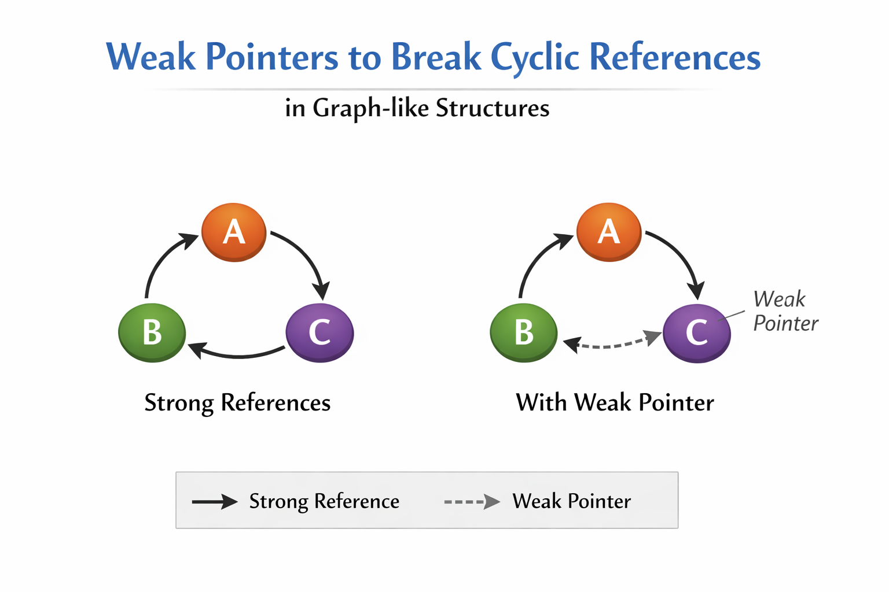

# Weak Pointers to Break Cyclic References in Graph-like Structures

Cyclic references occur when two or more objects reference each other in a cycle, meaning that their reference count never reaches zero. This can cause memory leaks, as the objects will never be deallocated since each one’s reference count is always non-zero.

In both **C++** and **Rust**, weak pointers help to break these cycles by allowing objects to reference each other without contributing to the reference count. This way, we can break the cycle, ensuring that when the last strong reference goes away, the objects can be properly deallocated.

Let's walk through this concept with simple graph-like structures for both languages.

---

## **Breaking Cyclic References in C++ Using `weak_ptr`**

Consider a graph-like structure where two nodes reference each other (cyclic reference). We can use `weak_ptr` to avoid the cycle and allow proper memory management.

### **C++ Example:**

```cpp
#include <iostream>
#include <memory>

class Node {
public:
    std::shared_ptr<Node> next;  // Strong reference to the next node
    std::weak_ptr<Node> prev;    // Weak reference to the previous node, avoids cyclic reference

    Node() {
        std::cout << "Node created!" << std::endl;
    }
    ~Node() {
        std::cout << "Node destroyed!" << std::endl;
    }
};

int main() {
    // Create two nodes, node1 and node2
    std::shared_ptr<Node> node1 = std::make_shared<Node>();
    std::shared_ptr<Node> node2 = std::make_shared<Node>();

    // Set up the cycle: node1 references node2 (strong), node2 references node1 (weak)
    node1->next = node2;
    node2->prev = node1;

    // At this point, node1 and node2 reference each other, but only node1's `next` is a strong reference.
    // `node2->prev` is weak and does not keep node1 alive.
    
    // Reset node1, which will delete the object if no other strong references exist
    node1.reset();

    // Check if node2 is still alive
    if (auto node2_ptr = node2->prev.lock()) {
        std::cout << "Node1 is still alive!" << std::endl;
    } else {
        std::cout << "Node1 has been destroyed." << std::endl;
    }

    return 0;
}
```

#### **Explanation:**

1. `Node` has a strong reference (`shared_ptr`) to the next node (`next`) and a weak reference (`weak_ptr`) to the previous node (`prev`).
2. The cycle is created between `node1` and `node2`, but the weak pointer (`prev` in `node2`) does not increase the reference count.
3. When `node1` is reset (deleted), the memory is freed because `node2`'s weak pointer (`prev`) does not keep `node1` alive.
4. `node2->prev.lock()` allows us to check if `node1` is still alive, and in this case, it will be destroyed as expected.

---

## **Breaking Cyclic References in Rust Using `Weak`**

Now, let’s consider the same situation in Rust, where we have two nodes referencing each other in a cyclic way. We can use `Weak` to break the cycle.

### **Rust Example:**

```rust
use std::cell::RefCell;
use std::rc::{Rc, Weak};

#[derive(Debug)]
struct Node {
    next: Option<Rc<RefCell<Node>>>,
    prev: Option<Weak<RefCell<Node>>>,
}

fn main() {
    // Create nodes (same as before)
    let node1 = Rc::new(RefCell::new(Node {
        next: None,
        prev: None,
    }));

    let node2 = Rc::new(RefCell::new(Node {
        next: None,
        prev: None,
    }));

    // Assign links (only change: borrow_mut)
    node1.borrow_mut().next = Some(Rc::clone(&node2));
    node2.borrow_mut().prev = Some(Rc::downgrade(&node1));

    //drop(node1);

    // Same weak upgrade logic
    if let Some(node1_rc) = node2.borrow().prev.as_ref().and_then(|w| w.upgrade()) {
        println!("node1 is still alive");
        println!("strong count = {}", Rc::strong_count(&node1_rc));
        println!("weak count   = {}", Rc::weak_count(&node1_rc));
    } else {
        println!("node1 not alive anymore!");
    }
}
```

#### **Explanation:**

1. The `Node` struct contains a `next` field, which is a strong reference (`Rc<Node>`), and a `prev` field, which is a weak reference (`Weak<Node>`).
2. The cycle is set up by making `node1` point to `node2` via `next`, and `node2` points back to `node1` using a weak pointer (`prev`).
3. After calling `drop(node1)`, the memory is freed because the weak reference does not keep `node1` alive.
4. `node2.prev.upgrade()` is used to check if `node1` is still alive. If `node1` has been dropped, this will return `None`.

---

### **Key Concept Recap:**

In both C++ and Rust:

* **Weak pointers** are used to avoid circular references (or cycles) in data structures like graphs, where objects refer to each other.
* A **strong reference** (`shared_ptr` in C++ or `Rc<...>` in Rust) keeps an object alive by increasing the reference count.
* A **weak reference** (`weak_ptr` in C++ or `Weak` in Rust) does not increase the reference count, so it doesn’t keep the object alive.
* Weak pointers allow objects to reference each other without creating a cycle that would prevent them from being deallocated once they’re no longer needed.

By using weak pointers, you can safely manage memory in complex data structures like graphs, where cyclic dependencies could otherwise lead to memory leaks.

